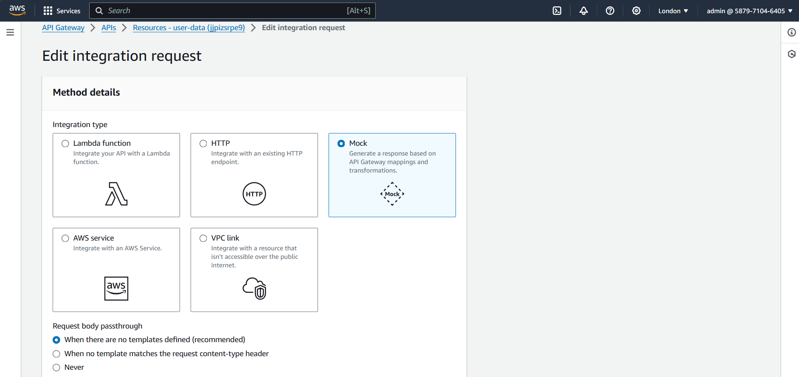

# BackEnd Logic Overview

The backend logic was created using AWS services;

1. [DynamoDB](#dynamodb)
2. [Lambda Function](#lambda-functions)
   - [Login_Reg Function](#1-login-lambda-function)
   - [user Data Function](#2-user-data-lambda-function)
   - [Notification Function](#3-notification-lambda-function)
3. [AWS API GateWay](#api-gateway)

## DynamoDB

We have to create a database(i.e. Table in Dynamodb) to store user data for the web application.

- In your AWS console, create a new table(for instance, 'login-database') with a primary key as `username(S)`.
<!-- upload dynamo create table -->

## Lambda Functions

Three lambda functions is created to enable the app to process data and take in data.

In the folder `lambda_Function` [here](./lambda_Function), it has all three functions used.

To use it, create a respective lambda functions for each zip file and upload the .zip file to your AWS lambda console.

- We are using `Nodejs` Lambda Function runtime for running our codes.

- And make required changes to uploaded lambda codes in your AWS Console.

For instance in;

<!-- upload image to the database -->

### 1. Login Lambda Function

This function handles, both user sign up & sign in of the web app.

For refrence, this is the original article used to create the function. [geeksforgeeks](https://www.geeksforgeeks.org/aws-lambda-and-amazon-dynamodb-for-serverless-authentication/)

- `login-lambda` function, change the name of database to your newly created DynamoDB Table name.
- Make sure to change region name in **login.js, register.js, & items.js files** in `services` folder.
  <!-- insert region name changes  -->
  

### 2. User Data Lambda Function

In this function, it take retrieve user data from database, process data to extract specific user data and then it sends the data to the app dashboard where it can be viewed via the API GateWay.

<!-- insert UI dashboard shot -->

- Change the name of database to your newly created DynamoDB Table name in the lambda code IDE.

### 3. Notification Lambda Function

For this lambda function, its role is to send email notification to new users registered on the web application.

It uses Dynamodb Streams to monitor items in dynamodb table, on every new item created/inserted, DynamoDB Streams invokes the notification function to extract user email from the data created/inserted and sends email notification using the email extracted.

To send email notifications, we are using Gmail SMTP for sending emails. For this we will need a user(i.e. gmail account to send emails) and a pass(or app pass) to enable function to send emails without using gmail account password.

Use the link provided to setup your your app pass that will used in the function. [SMTP_Setup](https://www.gmass.co/blog/gmail-smtp/#howto)

- Make sure your Gmail account has `2-Step Verification` enabled.

* Make the required changes to the file `mailer.js`.

In AWS DynamoDB console, turn on `DynamoDB Streams` in your Table to monitor new or old items.

<!-- insert dynamodb streams -->

Next, we'll create a trigger to invoke an AWS Lambda function every time an item is changed, and then your DynamoDB stream is updated.

<!-- insert trigger shot -->

## API GateWay

We create two APIs, `login-api:` that handles the Login-lambda function and `user-data:` that handles user-data lambda function.

- To configure the login-api, refer to this article [geeksforgeeks](https://www.geeksforgeeks.org/aws-lambda-and-amazon-dynamodb-for-serverless-authentication/)

- For `user-data` API, we will upload `user_Data` json file in `api_file folder`, after uploading we then 'create' our API, we have to edit integration request for the API for each resource path ( **ANY & OPTIONS** ).
  

  - For integration request of `ANY` resource path, we select lambda as a method and we select our lambda function then save changes.
    <!-- upload shots of ANY userdata api -->
    

  - For integration request of `OPTIONS` resource path, we select Mock as a method then we save changes. That's it.
    <!-- upload shots of OPTIONS userdata api -->
    

If correctly done, you should recieve a 200 status code, when testing with an API testing platform.
